# Networking Home Lab: VLAN, Router-on-a-Stick, DHCP & ACL

## Overview
This project demonstrates a simulated enterprise network using VLAN segmentation, inter-VLAN routing, DHCP, and access control lists (ACLs). The lab replicates how different departments communicate securely within a network.


## Topology
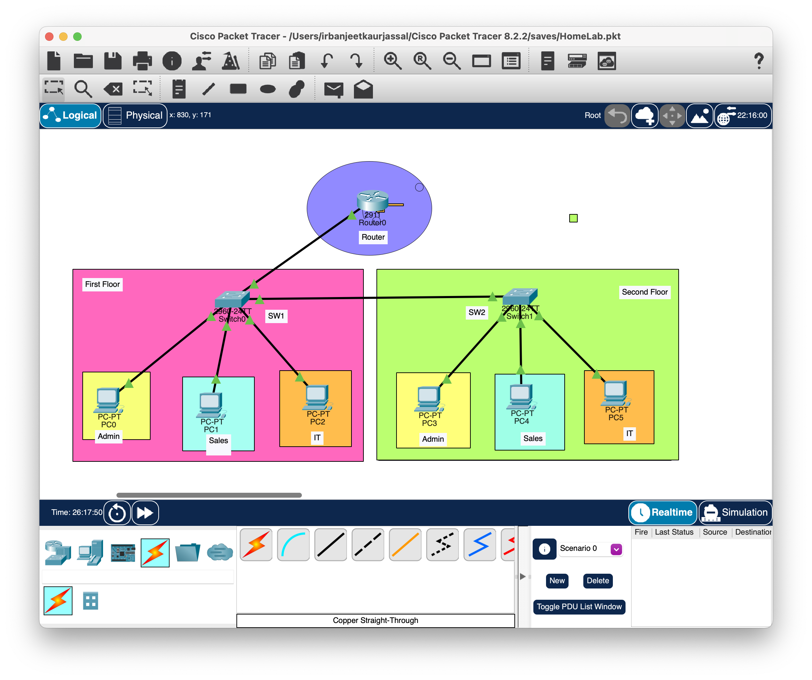


## Technologies Used
- VLANs (10, 20, 30)
- 802.1Q Trunking
- Router-on-a-Stick
- DHCP Server
- Extended ACLs


## VLAN Details
VLAN  Name    Network        

10    Admin   192.168.10.0/24 
20    Sales   192.168.20.0/24 
30    IT      192.168.30.0/24 


## Key Configurations

### Inter-VLAN Routing (Router-on-a-Stick)
- G0/0.10 → 192.168.10.1  
- G0/0.20 → 192.168.20.1  
- G0/0.30 → 192.168.30.1  

### DHCP Configuration
- Automatic IP assignment for all VLANs  
- Excluded IP ranges for gateway and reserved addresses  

### ACL Implementation
- Restricted communication from **Sales VLAN (20)** to **IT VLAN (30)**  
- Allowed all other traffic  


##  Screenshots

### VLAN Configuration (Switch 1)
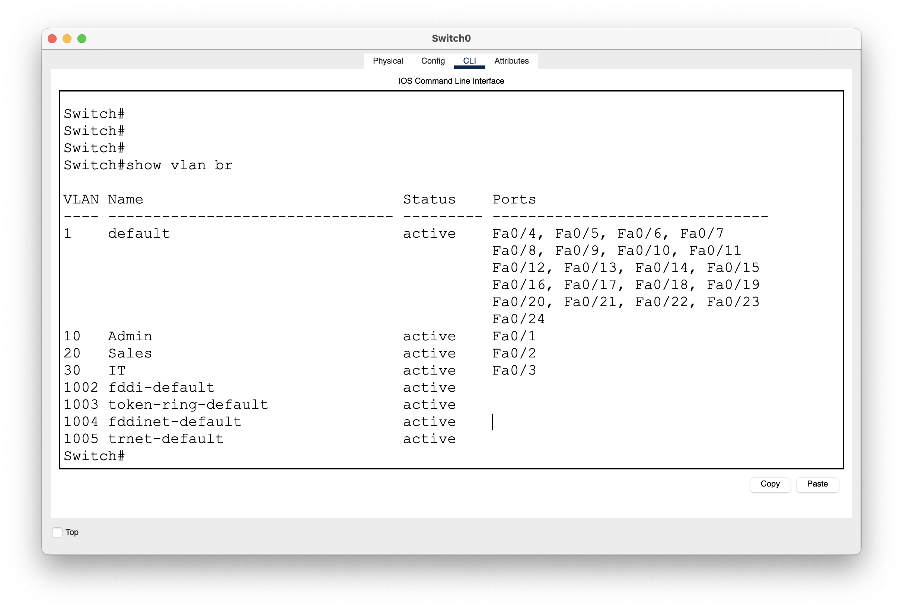

### VLAN Configuration (Switch 2)
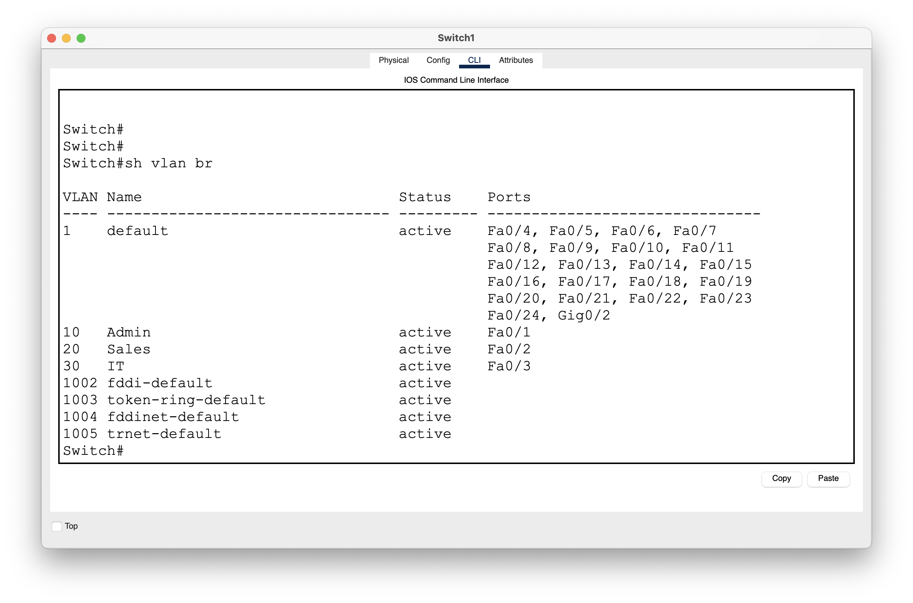


### Trunk Configuration (Switch 1)
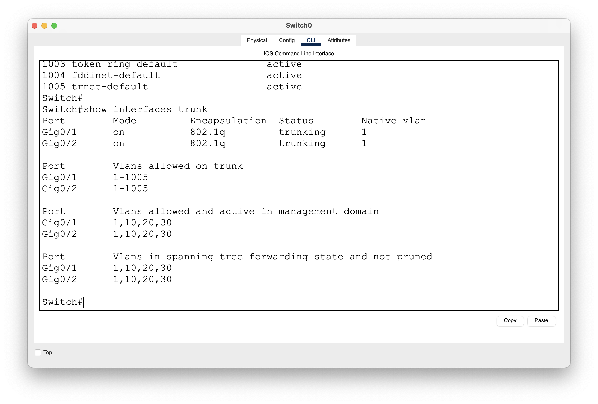

### Trunk Configuration (Switch 2)
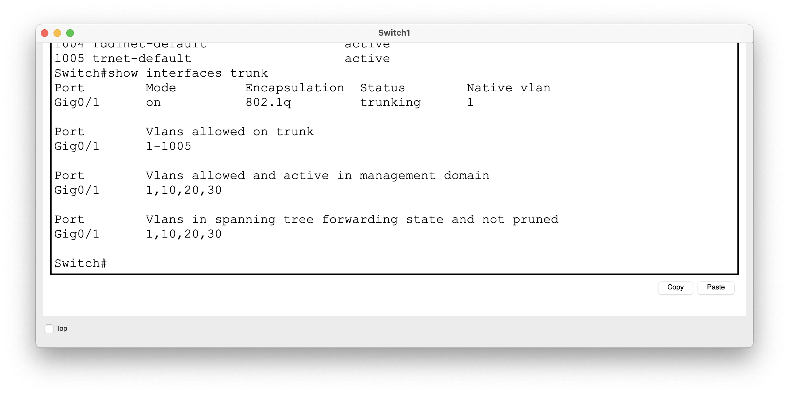


### Router Interfaces (Subinterfaces)
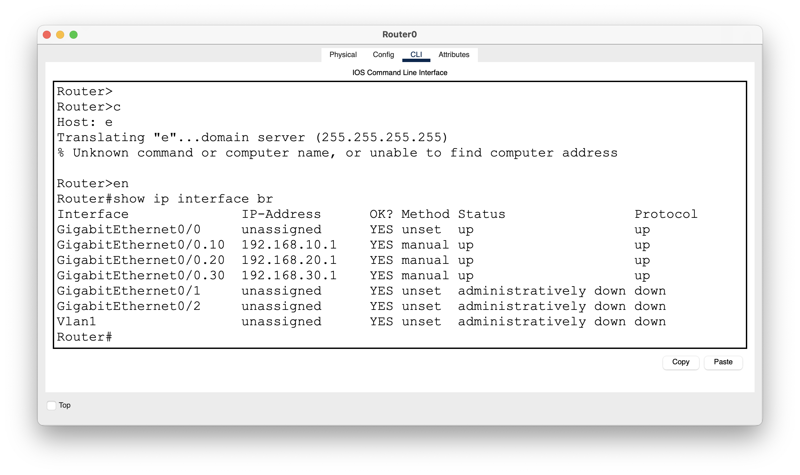


### DHCP IP Binding
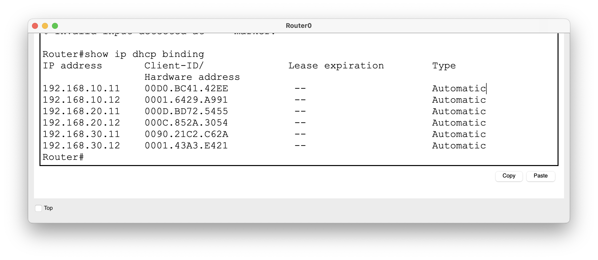


### PC IP Configuration
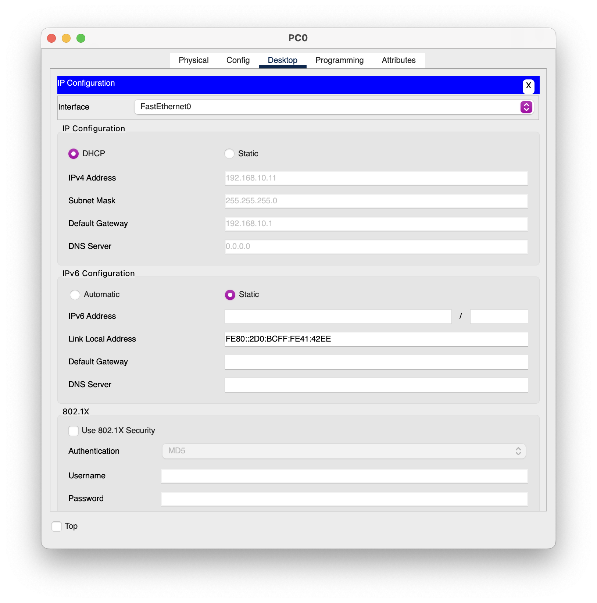


### Successful Inter-VLAN Communication
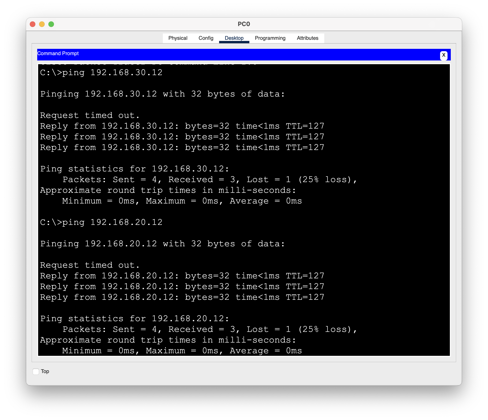


### ACL Blocking Traffic (Sales → IT)
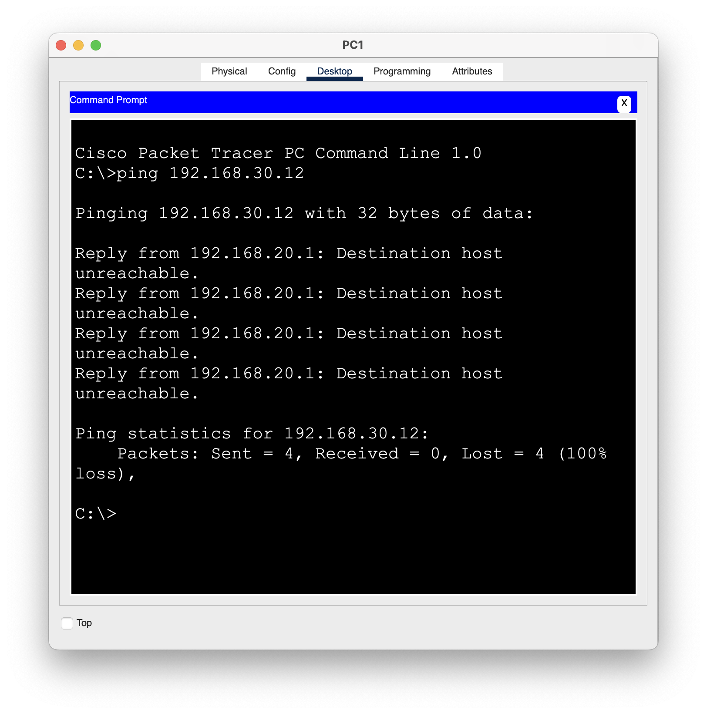


### ACL Configuration Verification
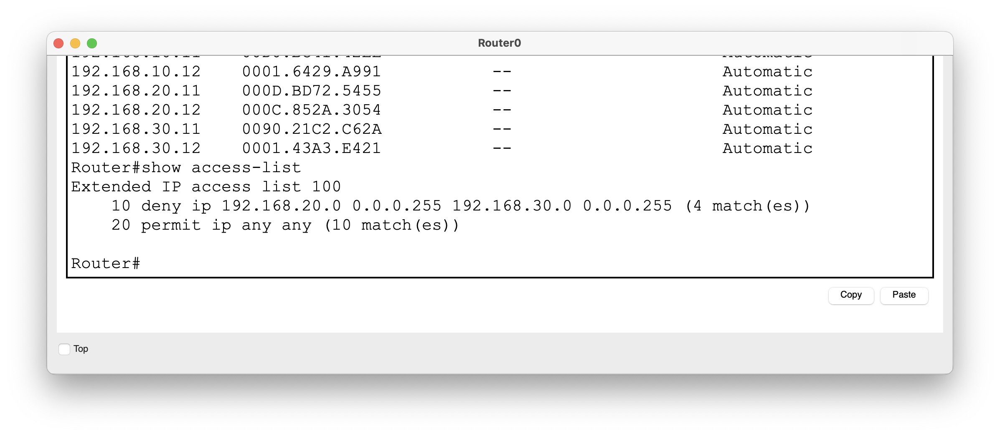


##  Results
- Devices successfully received IP addresses via DHCP  
- Inter-VLAN communication verified  
- ACL successfully blocked Sales VLAN from accessing IT VLAN  


## What I Learned
- VLAN segmentation improves network security and organization  
- Router-on-a-Stick enables communication between VLANs  
- DHCP simplifies IP address management  
- ACLs enforce security policies between departments  


## 📂 Project Structure
```
configs/
  ├── router.txt
  ├── switch1.txt
  ├── switch2.txt

screenshots/
  ├── vlan images
  ├── trunk images
  ├── dhcp
  ├── ping tests
  ├── acl
```


## Skills Demonstrated
- Network segmentation (VLANs)
- Routing & switching
- DHCP configuration
- Network security (ACLs)
- Troubleshooting and verification
